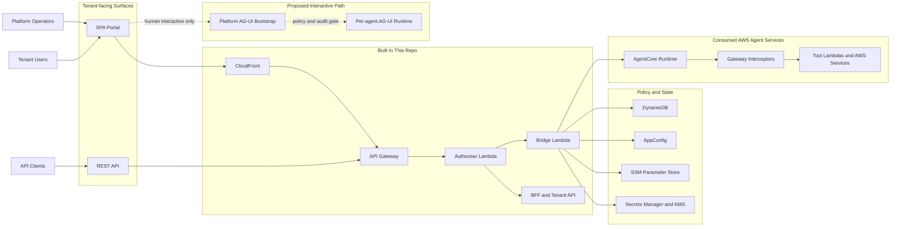
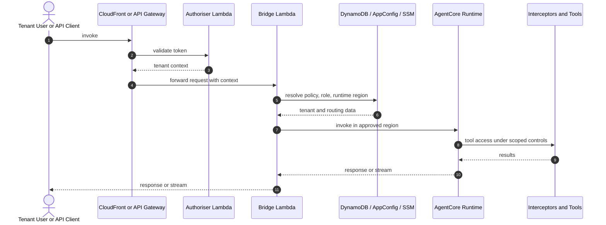
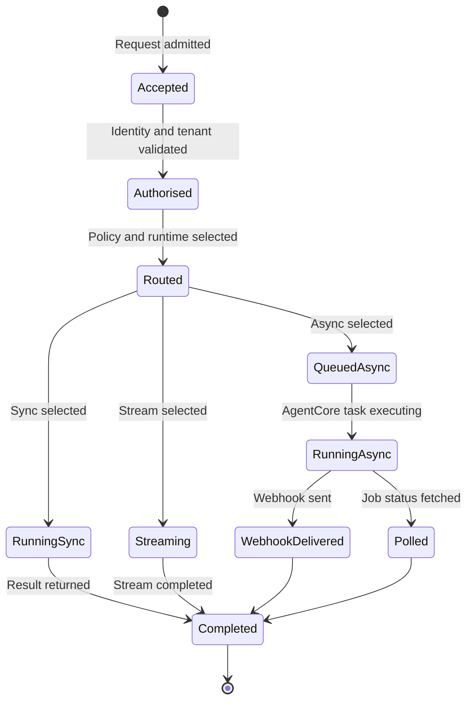
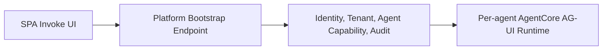
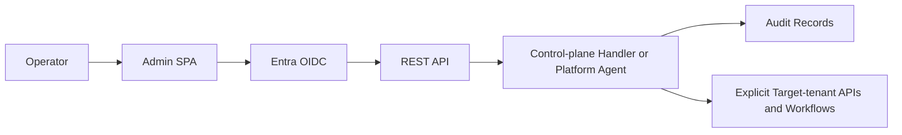

<p align="center">
  
</p>

# Agentic Infrastructure Framework: **a5c-cell**

`a5c-cell` is a multi-tenant agent platform on AWS. The shape is simple enough:

- users and API clients enter through a controlled platform edge
- the control plane authenticates, applies tenant policy, and routes requests
- the runtime plane executes agents and tools in AgentCore
- tenant isolation is enforced in depth across identity, IAM, gateway, and data layers

That is the useful model. Start there. The rest is detail.

## Why This Exists

Because running agents in production is not mainly a model problem. It is a control problem.

Someone has to answer the dull questions:

- who is allowed to invoke what
- which tenant the work belongs to
- which tools the agent may touch
- how to route execution safely
- how to recover when a region or dependency fails
- how to explain afterwards what happened

You can solve those one by one with scripts, conventions, and runbooks. That works for a while. Then the gaps start to matter.

Who builds it, who runs it? Usually the same people, whether they admit it or not.

This project is an attempt to put those controls into the system itself:

- identity and tenancy are explicit
- routing and execution are policy-bound
- audit is part of the path, not an afterthought
- agent teams can move quickly without owning the whole platform

It is not the only shape. It is a practical one.

Also, yes, it adds overhead. That is part of the question. If the control layer is not worth its own care and feeding, it is just another ornate way to delay delivery.

## Drinking Our Own Champagne

One useful end-state is a platform-ops agent running under the reserved internal
`platform` tenant and using the same control-plane surfaces everyone else is asked
to trust.

Not a hidden super-tenant. Not a bypass path. Just us proving the model on
ourselves first.

If we cannot run release, onboarding, operator assist, and fault response through
explicit APIs, audit trails, and tenant-scoped context, then the architecture is
performing confidence rather than earning it.

## Logical System View



## At A Glance

- The control plane lives in London and owns identity, policy, routing, audit, and tenant metadata.
- Agent execution runs mainly in Dublin, with Frankfurt reserved for evaluation and failover.
- Human users use the SPA. Machine callers use the REST API. AG-UI is a proposed additive path for selected interactive agents.

## What It Does

The platform has four jobs:

1. Admit requests with the right identity and tenant context.
2. Route work through tenant-aware policy and execution roles.
3. Run agents and tools in the approved AgentCore runtime plane.
4. Preserve audit, configuration, and operational control around those flows.

The value is the boundary around agent execution, not merely another place to run code.

That is the bet here: a paved control layer for agent workloads might be worth the
operational drag, but only if it survives realistic use.

## How It Moves

### Canonical REST Invoke Path

This is the main path. It is the one that matters for tenants and machine integrations.



This is where the control model stops being theory:

- `Authoriser Lambda` validates Entra JWTs and returns tenant context.
- `Bridge Lambda` resolves tenant execution role, applies routing policy, and invokes Runtime.
- `AgentCore Runtime` executes the agent in the approved runtime region.
- `Gateway Interceptors` and tools enforce scoped downstream access.

### Async Job Path

The request modes are different, but the control model is the same.



The same controls still apply:

- session and invocation records
- webhook delivery and retries
- job status lookup

### Proposed AG-UI Path

AG-UI is proposed as an additive human-facing path, not a replacement for the REST API.



Design rules:

- REST remains the canonical machine and E2B API.
- AG-UI is only for selected interactive agents.
- AG-UI must remain platform-mediated, not direct browser bypass.
- AG-UI is per-agent, not a shared runtime.

## What Lives Where

This only stays legible if each layer does one thing clearly:

| Layer | Purpose |
|-------|---------|
| Experience layer | SPA and API entry points for people and client systems |
| Control plane | Identity, policy, routing, tenancy, audit, and operational APIs |
| Runtime plane | AgentCore execution, gateway interception, and tool access |
| Policy and state | Tenant metadata, runtime parameters, rollout policy, and audit records |
| Proposed AG-UI path | Human interactive sessions for agents that explicitly opt in |

## Regional Shape

The logical model comes first. Physical placement comes second.

```text
eu-west-2 London
  Control plane, identity, API, storage, config, audit

eu-west-1 Dublin
  Primary AgentCore runtime execution

eu-central-1 Frankfurt
  Evaluation and runtime failover target
```

The point is to keep policy and tenant state anchored in the home region while runtime executes in the approved compute region.

## Isolation

Tenant isolation is enforced in depth across four independent layers:

1. REST authoriser validates JWT and tenant status.
2. Bridge assumes a tenant-specific execution role.
3. Gateway interceptors scope downstream access and tool permissions.
4. Data access libraries reject cross-tenant reads and writes.

This matters because the safety model is compositional. One control failure should not collapse tenant isolation.

## Operating Ourselves

The platform also supports an internal `platform` tenant for control-plane agents and operator-assisted automation.



Important constraint:

- the `platform` tenant is not a super-tenant
- cross-tenant actions must still use explicit control-plane APIs
- operator identity and target-tenant context must be auditable

## Why This README Is Shaped This Way

The README should answer the system-shape questions quickly. Detailed service choreography belongs in the architecture docs, where people can opt in to the detail.

The right order is:

1. Logical system view
2. Interaction paths
3. Regional deployment view
4. Tenant isolation and operator model
5. Deep lifecycle diagrams in the architecture docs

A first-time reader should be able to answer these questions quickly:

- Who are the actors?
- What is the control plane?
- What is the runtime plane?
- Where is tenant policy enforced?
- What is the difference between REST and AG-UI?

If the README answers those first, the deeper diagrams in [docs/ARCHITECTURE.md](/mnt/c/Users/julia/tf-acore-aas/docs/ARCHITECTURE.md) are easier to read without pretending to be introductory.

## Further Reading

- [README.md](/mnt/c/Users/julia/tf-acore-aas/README.md) for the current main project README
- [docs/ARCHITECTURE.md](/mnt/c/Users/julia/tf-acore-aas/docs/ARCHITECTURE.md) for the detailed architecture
- [docs/decisions/ADR-018-agentcore-ag-ui-integration.md](/mnt/c/Users/julia/tf-acore-aas/docs/decisions/ADR-018-agentcore-ag-ui-integration.md) for the AG-UI proposal
