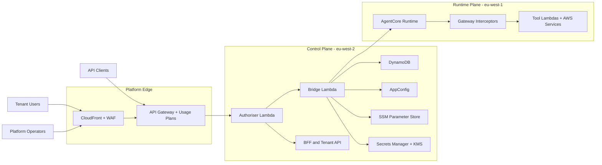
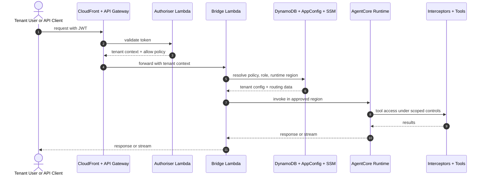
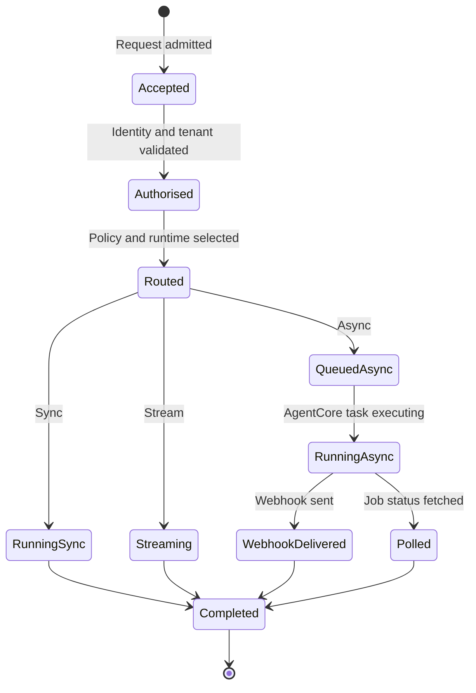
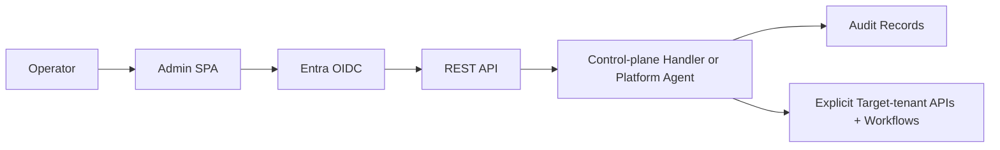

<p align="center">
  
</p>

# Agentic Infrastructure Framework: **a5c-cell**

## Atomic AWS service cells for agent workloads

**a5c-cell** is a personal exploratory project, production-informed but free-formed. It packages agent workloads into repeatable, operable service cells on AWS-managed infrastructure, adding a microservice control layer over Amazon Bedrock and AgentCore that gives each cell partitionable tenancy, operational tooling, logging, control points, a fast development inner loop, and for human users — a scaffolded SPA on CloudFront.

> _**a5c??** A typographic abbreviation of *agentic*. It makes more sense when you know k8s, but it needed a name._

## Why this exists

At its core, this project asks a practical question: can a bootable, paved, end-to-end stack for operations, tooling, agent development inner loops, and tenancy act as a reusable cellular platform layer — and is that layer worth the operational overhead when compared with runbooks, SOPs, and business-as-usual DevOps procedure?

The squeeze is real: overhead, maintenance, roadmap pressure, resourcing, operational demarcation, developer experience, inner loop speed, lifecycle management of hosted agents, and the continuing care and feeding of the framework itself.

### Who builds it, who runs it?

Normally the same answer as "who decides it's actually prod ready." No one, in this case, so I built as if to happily transfer between my alter-egos for 100 days. New tech needs to be underpinned by sharp-end skill, and devs are usually first to hit the "unsupported yet" wall.

The aim was not merely to prototype, but to test whether an operable task and automation layer for agent workloads could survive realistic operating conditions. And sample the dev experience. The result is a practical Ops CLI, a supersonic inner loop, and a runbook model that supports federated ownership, clearer standardisation, and better alignment with emerging AI operations practice.

### Scaling demarcation

Every **a5c-cell** maps 1:1 to an AWS account, a service boundary, an operations and accounting unit, a resource namespace, a resource boundary, and a fixed service allow list.

## Highlights

- **Multi-tenant REST API** — per-request tenant isolation enforced across four independent control layers
- **Entra ID OIDC and SigV4** — human and machine authentication, with no Cognito dependency
- **Three invocation modes** — synchronous up to 15 minutes, streaming SSE up to 15 minutes, and asynchronous execution with webhooks up to 8 hours
- **Self-service agent pipeline** — `make agent-push` supports a fast path when dependencies are unchanged
- **SPA frontend** — React application with OIDC login, streaming responses, and session keepalive
- **EU-only data residency** — approved topology keeps data in London and runtime in Dublin, with evaluation capability in Frankfurt
- **LocalStack developer loop** — full local inner loop without AWS credentials

## Architecture

> Full details: [docs/ARCHITECTURE.md](docs/ARCHITECTURE.md)
> Diagram catalogue: [docs/README.md#diagram-catalog](docs/README.md#diagram-catalog)

### System shape

Tenants invoke AI agents through a controlled REST interface with tenant isolation, billing attribution, and compliance controls designed in from the start. The platform has four jobs: admit requests with the right identity and tenant context, route work through tenant-aware policy and execution roles, run agents and tools in the approved AgentCore runtime plane, and preserve audit, configuration, and operational control around those flows.



*System topology: three actor types enter through the platform edge. The control plane in London resolves identity, policy, and routing. The runtime plane in Dublin executes agents under scoped controls. Regions reflect the current deployment topology defined in ADR-009.*

### Request lifecycle

Client → CloudFront → API Gateway with WAF and usage plan → **Authoriser** for JWT validation and tenant context → **Bridge** for tenant role assumption and runtime dispatch → **AgentCore Runtime** in Firecracker microVM → **Gateway interceptors** for act-on-behalf tokens and tier filtering → Tool Lambdas → response stream returned to client.



### Invocation modes

The same control model applies to all three invocation modes — sync, streaming, and async. The differences are in execution dispatch and response delivery, not in admission or policy.



*All three modes share the admission, authorisation, and routing path. They diverge at execution. Async mode adds webhook delivery, retries, and job status lookup.*

### Tenant isolation

Tenant isolation is enforced in depth across four layers:

| Layer | Component | Enforcement |
|-------|-----------|-------------|
| 1 | REST API Authoriser | Validates JWT and rejects invalid or suspended tenants |
| 2 | Bridge Lambda | Assumes tenant-specific IAM execution role |
| 3 | Gateway Interceptors | Issues scoped act-on-behalf token and tier-filtered tool access |
| 4 | data-access-lib | `TenantScopedDynamoDB` raises `TenantAccessViolation` on cross-tenant access |

A single-layer failure is not sufficient to compromise tenant data boundaries. This is compositional by design — because in a multi-tenant agentic platform, the agent itself is an autonomous actor with tool access. Cross-tenant reach is not a data leak, it is a compromised agent.

### Regional topology

The control plane and the runtime plane are in different regions. This is not an accident.

#### Why separate the planes

AWS prescriptive guidance for both [SaaS architecture](https://docs.aws.amazon.com/whitepapers/latest/saas-architecture-fundamentals/control-plane-vs.-application-plane.html) and [multi-tenant agentic AI](https://docs.aws.amazon.com/prescriptive-guidance/latest/agentic-ai-multitenant/employing-control-planes-in-agentic-environments.html) recommends separating control plane from application plane. The control plane owns onboarding, identity, policy, metering, and operational management across all tenants. The application plane — here, the AgentCore runtime — is where tenant workloads execute. These concerns have different failure modes, different scaling profiles, and different blast radii. A control plane outage does not affect one workload; it removes identity resolution, policy enforcement, and audit for every tenant simultaneously.

The [Fault Isolation Boundaries](https://docs.aws.amazon.com/whitepapers/latest/aws-fault-isolation-boundaries/control-planes-and-data-planes.html) whitepaper reinforces the point: data planes are intentionally simpler, with fewer moving parts, and the design goal is static stability — if the control plane is impaired, the runtime continues serving on previously resolved configuration. The [multi-tenant AaaS guidance](https://docs.aws.amazon.com/prescriptive-guidance/latest/agentic-ai-multitenant/enforcing-tenant-isolation.html) extends this explicitly to agentic workloads, where tenant isolation, noisy-neighbour throttling, and tier-based policy all benefit from a control plane that is not competing for the same compute and failure domain as the agents.

#### Current deployment

| Region | Role | Key services |
|--------|------|-------------|
| **eu-west-2** London | HOME — control and data plane | REST API Gateway, WAF, CloudFront, DynamoDB, S3, Secrets Manager, SSM, Lambda, KMS |
| **eu-west-1** Dublin | COMPUTE — primary runtime | AgentCore Runtime arm64 Firecracker, Observability, Browser, Code Interpreter |
| **eu-central-1** Frankfurt | EVALUATION and failover | AgentCore Evaluations, runtime failover target |

#### Intentional optionality

This regional split was intentional optionality: at the time of ADR-009, AgentCore Runtime was not available in London, so the architecture treats the runtime region as a policy-driven parameter rather than a hardcoded assumption. AWS has since expanded AgentCore availability across multiple EU regions, largely superseding the original availability constraint. The topology remains in place pending an architecture review and controlled migration decision — but the separation of concerns it enforces is worth preserving regardless of which region hosts what.

### Entity lifecycle and CDK dependencies


`NetworkStack` → `IdentityStack` → `PlatformStack` → `TenantStack` per tenant, event-driven → `ObservabilityStack` → `AgentCoreStack`

## Drinking our own champagne

One direction for the platform is a reserved internal `platform` tenant with a platform-ops agent that operates the system through the same control-plane surfaces the product exposes. Not a super-tenant, not a bypass path — just us proving the model on ourselves first, with agents operating our runbooks and troubleshooting.

If we cannot run release, onboarding, and operator-assist flows safely through explicit APIs, audit trails, and tenant-scoped context, the platform contract is weaker than it looks.



*The internal platform tenant uses the same control-plane surfaces as external tenants. Operator identity and target-tenant context are always auditable. Cross-tenant actions require explicit control-plane APIs.*

## Quick start

**Prerequisites**: [uv](https://docs.astral.sh/uv/) 0.4+, Docker 24+, AWS CLI v2, Node 20 LTS, npm, GitLab access, and the required Entra group membership.

```bash
git clone <repo> && cd tf-acore-aas
cp .env.example .env.local    # Set ENTRA_CLIENT_ID, ENTRA_TENANT_ID, API_BASE_URL
make bootstrap                # Check prerequisites and install Python and Node dependencies
make dev                      # Start LocalStack, mock Runtime, and mock JWKS
make dev-invoke               # Confirm echo-agent works end-to-end locally
```

| Next step | Guide |
|-----------|-------|
| Full local environment | [Local Development Setup](docs/development/LOCAL-SETUP.md) |
| First AWS deployment | [Bootstrap Guide](docs/bootstrap-guide.md) |
| Entra app registration | [Entra Setup](docs/entra-setup.md) |

## Project structure

```text
tf-acore-aas/
├── CLAUDE.md                 AI coding assistant rules
├── Makefile                   Dev, test, ops, and deploy commands
├── .env.example               Required environment variables
│
├── docs/                      Documentation suite
│   ├── README.md              Index, diagram catalogue, role-based reading guide
│   ├── ARCHITECTURE.md        System design, data model, failure modes
│   ├── PLAN.md                Phased delivery plan with gates
│   ├── ROADMAP.md             Vision, milestones M1–M7, V1.x backlog
│   ├── decisions/             ADR-001..018
│   ├── operations/            RUNBOOK-000..009
│   ├── security/              Threat model, compliance checklist
│   ├── development/           Local setup, agent developer guide
│   └── images/                Diagrams and exported assets
│
├── agents/                    Agent implementations
│   └── echo-agent/            Reference agent template
├── gateway/                   AgentCore Gateway interceptor Lambdas
├── src/                       Platform Lambda functions
│   ├── authoriser/            JWT token authoriser
│   ├── bridge/                Agent invocation bridge
│   ├── bff/                   Token refresh and session keepalive
│   ├── tenant_api/            Tenant CRUD API
│   ├── billing/               Billing and metering handlers
│   ├── webhook_delivery/      Async result delivery
│   └── data-access-lib/       Tenant-scoped DynamoDB and S3 access library
├── spa/                       React SPA frontend
├── infra/
│   ├── cdk/                   CDK stacks in strict TypeScript
│   └── terraform/             Account vending only
├── scripts/                   Ops, bootstrap, and agent packaging
└── tests/                     Integration and cross-cutting tests
```

## Development workflow

### Getting started

```bash
make bootstrap                # One-time: check prerequisites and install dependencies
make install-git-hooks        # One-time: install pre-push hook
make dev                      # Start LocalStack and mock services
make test-unit                # Run all unit tests
make validate-local           # ruff + pyright + tsc + cdk synth + detect-secrets
```

### Working on issues

All work is tracked through [GitHub Issues](https://github.com/j3brns/tf-acore-aas/issues), using `Seq:` for ordering and `Depends on:` for dependency gating.

```bash
make issue-queue              # Dependency-aware queue ordered by Seq
make worktree-next-issue      # Create worktree for next runnable issue
make worktree                 # Interactive worktree menu
make wt-go                    # Create next runnable worktree and launch zellij session
make preflight-session        # Branch and issue policy checks
make pre-validate-session     # Fast pre-push validation without cdk synth
make worktree-push-issue      # Push with preflight and validation enforced
```

### Agent developer inner loop

Agent teams can push and iterate on agents independently through a responsive inner-loop harness, including local stack support for development and test. In practice, this creates a fast self-service path that separates agent code from heavier platform dependencies — sub-production releases and aliased challengers can move without waiting for a full outer-loop platform release.

> _Useful? Certainly. Also the sort of thing that encourages dangerous optimism. Please do not test in production. Not yet._

```bash
make agent-test AGENT=my-agent              # Local logic and golden tests
make agent-push AGENT=my-agent ENV=dev      # Push to AWS dev compute
make agent-invoke AGENT=my-agent ENV=dev    # Invoke on real AWS
```

`make agent-push` uses the fast path when dependencies are unchanged, which keeps the inner loop quick without bypassing the platform boundary entirely. Local development of agent logic is done via `pytest` and `make agent-test`.

### Frontend developer inner loop

```bash
make spa-dev                  # Local SPA dev server against mock API
make spa-push ENV=dev         # Build, publish to S3, invalidate CloudFront
```

### Operations

```bash
make ops-top-tenants ENV=prod
make ops-quota-report ENV=prod
make ops-backfill-tenant-role-arn APPLY=1
make failover-lock-acquire && \
  make infra-set-runtime-region REGION=eu-central-1 ENV=prod
```

See [Operator Runbooks](docs/operations/) for incident procedures and operational detail.

## Contributing

1. Pick an issue: `make issue-queue`
2. Create a worktree: `make worktree-create-issue ISSUE=<N>`
3. Implement and test: write code, run `make test-unit`, iterate
4. Validate: `make preflight-session && make pre-validate-session`
5. Push: `make worktree-push-issue`
6. Open a pull request and link the issue; CI runs full validation

Platform Lambda source directories use `snake_case`. The shared `src/data-access-lib/` workspace is the tenant-scoped data access package. See [CLAUDE.md](CLAUDE.md) for conventions and branch naming patterns.

## Technology stack

| Concern | Technology |
|---------|-----------|
| Agent runtime | Amazon Bedrock AgentCore Runtime arm64 Firecracker; primary runtime region is eu-west-1 |
| Human authentication | Microsoft Entra ID OIDC |
| Machine authentication | AWS SigV4 |
| Platform IaC | AWS CDK with strict TypeScript |
| Account IaC | Terraform HCL |
| Python tooling | uv and pyproject.toml |
| Logging | aws-lambda-powertools Logger structured JSON |
| CDK testing | Jest and cdk-assertions |
| Python testing | pytest and LocalStack |
| Secrets | AWS Secrets Manager |
| Configuration | AWS AppConfig for dynamic capability policy; AWS SSM Parameter Store for runtime/platform parameters |
| Async agents | AgentCore add_async_task and complete_async_task SDK |
| Observability | AgentCore Observability and Amazon CloudWatch |

## Key documents

| Document | Audience | Description |
|----------|----------|-------------|
| [Documentation Suite](docs/README.md) | All | Entry point, diagram catalogue, role-based reading guide |
| [Portal previews](docs/README.md#portal-page-previews) | Engineers, QA, Ops | Fixture-based previews of tenant and admin SPA views |
| [Architecture](docs/ARCHITECTURE.md) | Engineers | System topology, data model, scaling, and failure modes |
| [Roadmap](docs/ROADMAP.md) | All | Vision, milestones M1–M7, and V1.x backlog |
| [Delivery Plan](docs/PLAN.md) | Engineers | Phased plan with gates and success criteria |
| [Bootstrap Guide](docs/bootstrap-guide.md) | Ops | Day-zero environment deployment |
| [Entra Setup](docs/entra-setup.md) | Ops | Entra application registration |
| [Agent Developer Guide](docs/development/AGENT-DEVELOPER-GUIDE.md) | Agent developers | Build, test, and push agents |
| [Local Setup](docs/development/LOCAL-SETUP.md) | Engineers | Full local development environment |
| [Threat Model](docs/security/THREAT-MODEL.md) | Security | Threat analysis and mitigations |
| [Compliance Checklist](docs/security/COMPLIANCE-CHECKLIST.md) | Security | Controls and evidence tracking |
| [Operator Runbooks](docs/operations/) | Ops | Incident procedures and operational runbooks |
| [Architecture Decisions](docs/decisions/) | Engineers | ADR-001..018 |
| [GitHub Issues](https://github.com/j3brns/tf-acore-aas/issues) | All | Canonical task queue |

## Contacts

| Role | Contact |
|------|---------|
| Faith | Hope |
