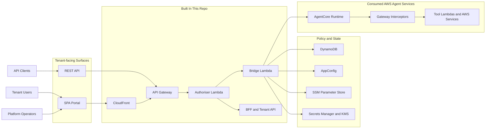
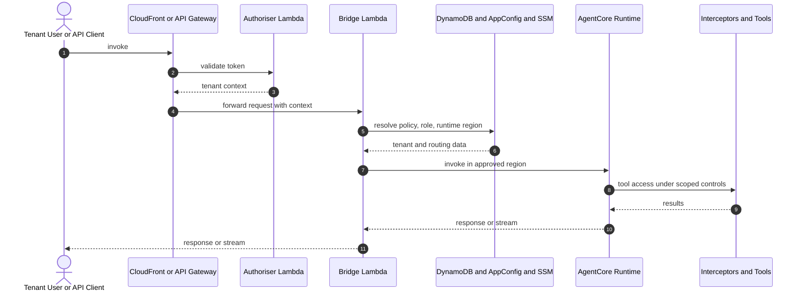
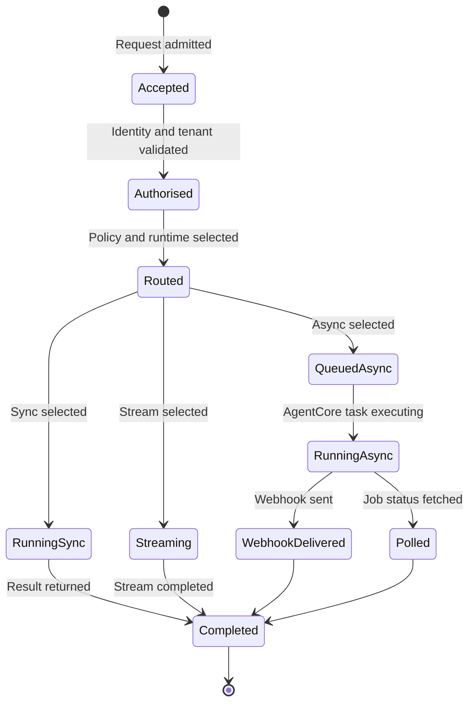
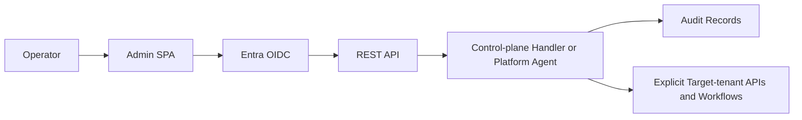

<p align="center">
  
</p>

# Agentic Infrastructure Framework: **a5c-cell**

`a5c-cell` is a multi-tenant agent platform on AWS. Users and API clients enter through a controlled platform edge. The control plane authenticates, applies tenant policy, and routes requests. The runtime plane executes agents and tools in AgentCore. Tenant isolation is enforced in depth across identity, IAM, gateway, and data layers.

> _**a5c??** A typographic abbreviation of *agentic*. It makes more sense when you know k8s, but it needed a name._

This is a personal exploratory project, production-informed but free-formed. It asks whether a bootable, paved control layer for agent workloads is worth the operational overhead compared with runbooks, SOPs, and conventional DevOps procedure. The answer is not yet settled.

## What the Platform Does

The platform has four jobs: admit requests with the right identity and tenant context, route work through tenant-aware policy and execution roles, run agents and tools in the approved AgentCore runtime plane, and preserve audit, configuration, and operational control around those flows. The value proposition is the boundary around agent execution, not merely another place to run code.



*Logical system view: three actor types enter through the experience layer. The control plane resolves identity, policy, and routing. The runtime plane executes agents under scoped controls.*

## Highlights

- **Multi-tenant REST API** with per-request tenant isolation enforced across four independent control layers
- **Entra ID OIDC and SigV4** for human and machine authentication, with no Cognito dependency
- **Three invocation modes**: synchronous up to 15 minutes, streaming SSE up to 15 minutes, and asynchronous execution with webhooks up to 8 hours
- **Self-service agent pipeline** via `make agent-push` with a fast path when dependencies are unchanged
- **SPA frontend** with OIDC login, streaming responses, and session keepalive
- **EU-only data residency** across London, Dublin, and Frankfurt
- **LocalStack developer loop** for full local inner-loop development without AWS credentials

## How Requests Move

### Canonical REST Invoke Path

This is the primary path for tenants and machine integrations.



*Request lifecycle: the Authoriser Lambda validates Entra JWTs and returns tenant context. The Bridge Lambda resolves the tenant execution role, applies routing policy, and invokes AgentCore Runtime in the approved region. Gateway Interceptors enforce scoped downstream access.*

### Async and Streaming Modes

The request modes differ, but the control model is identical. Session and invocation records, webhook delivery and retries, and job status lookup all apply regardless of mode.



*Invocation modes: all three modes pass through the same admission, authorisation, and routing controls before diverging at execution.*

## Layer Responsibilities

| Layer | Purpose |
|-------|---------|
| Experience layer | SPA and REST API entry points for people and client systems |
| Control plane | Identity, policy, routing, tenancy, audit, and operational APIs |
| Runtime plane | AgentCore execution, gateway interception, and tool access |
| Policy and state | Tenant metadata, runtime parameters, rollout policy, and audit records |

## Regional Topology

AWS prescriptive guidance for both [SaaS architecture](https://docs.aws.amazon.com/whitepapers/latest/saas-architecture-fundamentals/control-plane-vs.-application-plane.html) and [multi-tenant agentic AI](https://docs.aws.amazon.com/prescriptive-guidance/latest/agentic-ai-multitenant/employing-control-planes-in-agentic-environments.html) consistently recommends separating control plane from application plane. The control plane owns onboarding, identity, policy, metering, and operational management across all tenants. The application plane — in this case, the AgentCore runtime — is where tenant workloads actually execute. This separation matters for multi-tenant agent platforms specifically because the control plane must remain available and consistent even when runtime compute is under pressure from noisy-neighbour load, regional service events, or agent failures. A control plane outage in a multi-tenant system does not just affect one workload; it removes identity resolution, policy enforcement, and audit for every tenant simultaneously. Keeping it physically and operationally distinct from the runtime plane reduces the blast radius of either plane failing.

The [AWS Fault Isolation Boundaries](https://docs.aws.amazon.com/whitepapers/latest/aws-fault-isolation-boundaries/control-planes-and-data-planes.html) whitepaper reinforces this: data planes are intentionally simpler, with fewer moving parts, making failure events statistically less likely than in control planes. The design goal is static stability — if the control plane is impaired, the runtime plane continues serving requests using previously resolved configuration.

In `a5c-cell`, the control plane runs in eu-west-2 London and the AgentCore runtime executes in eu-west-1 Dublin, with eu-central-1 Frankfurt reserved for evaluation and failover. All data remains within EU regions. This regional split was intentional optionality: at the time of ADR-009, AgentCore Runtime was not available in London, so the architecture was designed to treat the runtime region as a policy-driven parameter rather than a hardcoded assumption. AWS has since expanded AgentCore availability across multiple EU regions, largely superseding the original availability constraint. The topology remains in place pending an architecture review and controlled migration decision.

## Tenant Isolation

Tenant isolation is enforced in depth across four independent layers:

| Layer | Component | Enforcement |
|-------|-----------|-------------|
| 1 | REST API Authoriser | Validates JWT and rejects invalid or suspended tenants |
| 2 | Bridge Lambda | Assumes tenant-specific IAM execution role |
| 3 | Gateway Interceptors | Issues scoped act-on-behalf token and tier-filtered tool access |
| 4 | data-access-lib | `TenantScopedDynamoDB` raises `TenantAccessViolation` on cross-tenant access |

The safety model is compositional. A single-layer failure is not sufficient to compromise tenant data boundaries.

## Operating Ourselves

The platform supports an internal `platform` tenant for control-plane agents and operator-assisted automation. This is not a super-tenant or a bypass path. Cross-tenant actions must use explicit control-plane APIs, and operator identity and target-tenant context must be auditable.



*Platform operator path: the internal platform tenant uses the same control-plane surfaces as external tenants, with auditable operator identity and explicit target-tenant context.*

## Quick Start

**Prerequisites**: [uv](https://docs.astral.sh/uv/) 0.4+, Docker 24+, AWS CLI v2, Node 20 LTS, npm, GitLab access, and the required Entra group membership.

```bash
git clone <repo> && cd tf-acore-aas
cp .env.example .env.local    # Set ENTRA_CLIENT_ID, ENTRA_TENANT_ID, API_BASE_URL
make bootstrap                # Check prerequisites and install Python and Node dependencies
make dev                      # Start LocalStack, mock Runtime, and mock JWKS
make dev-invoke               # Confirm echo-agent works end-to-end locally
```

| Next step | Guide |
|-----------|-------|
| Full local environment | [Local Development Setup](docs/development/LOCAL-SETUP.md) |
| First AWS deployment | [Bootstrap Guide](docs/bootstrap-guide.md) |
| Entra app registration | [Entra Setup](docs/entra-setup.md) |

## Development Workflow

All work is tracked through [GitHub Issues](https://github.com/j3brns/tf-acore-aas/issues), using `Seq:` for ordering and `Depends on:` for dependency gating.

```bash
make issue-queue              # Dependency-aware queue ordered by Seq
make worktree-next-issue      # Create worktree for next runnable issue
make preflight-session        # Branch and issue policy checks
make worktree-push-issue      # Push with preflight and validation enforced
```

### Agent Developer Inner Loop

```bash
make agent-test AGENT=my-agent              # Local logic and golden tests
make agent-push AGENT=my-agent ENV=dev      # Push to AWS dev compute
make agent-invoke AGENT=my-agent ENV=dev    # Invoke on real AWS
```

`make agent-push` uses the fast path when dependencies are unchanged, keeping the inner loop quick without bypassing the platform boundary.

## Technology Stack

| Concern | Technology |
|---------|-----------|
| Agent runtime | Amazon Bedrock AgentCore Runtime arm64 Firecracker in eu-west-1 |
| Human authentication | Microsoft Entra ID OIDC |
| Machine authentication | AWS SigV4 |
| Platform IaC | AWS CDK with strict TypeScript |
| Account IaC | Terraform HCL |
| Python tooling | uv and pyproject.toml |
| Logging | aws-lambda-powertools Logger structured JSON |
| Secrets | AWS Secrets Manager |
| Configuration | AppConfig for dynamic capability policy; SSM Parameter Store for runtime parameters |
| Async agents | AgentCore add_async_task and complete_async_task SDK |
| Observability | AgentCore Observability and Amazon CloudWatch |

## Key Documents

| Document | Audience | Description |
|----------|----------|-------------|
| [Documentation Suite](docs/README.md) | All | Entry point, diagram catalogue, role-based reading guide |
| [Architecture](docs/ARCHITECTURE.md) | Engineers | System topology, data model, scaling, and failure modes |
| [Roadmap](docs/ROADMAP.md) | All | Vision, milestones M1-M7, and V1.x backlog |
| [Delivery Plan](docs/PLAN.md) | Engineers | Phased plan with gates and success criteria |
| [Agent Developer Guide](docs/development/AGENT-DEVELOPER-GUIDE.md) | Agent developers | Build, test, and push agents |
| [Threat Model](docs/security/THREAT-MODEL.md) | Security | Threat analysis and mitigations |
| [Operator Runbooks](docs/operations/) | Ops | Incident procedures and operational runbooks |
| [Architecture Decisions](docs/decisions/) | Engineers | ADR-001..018 |
