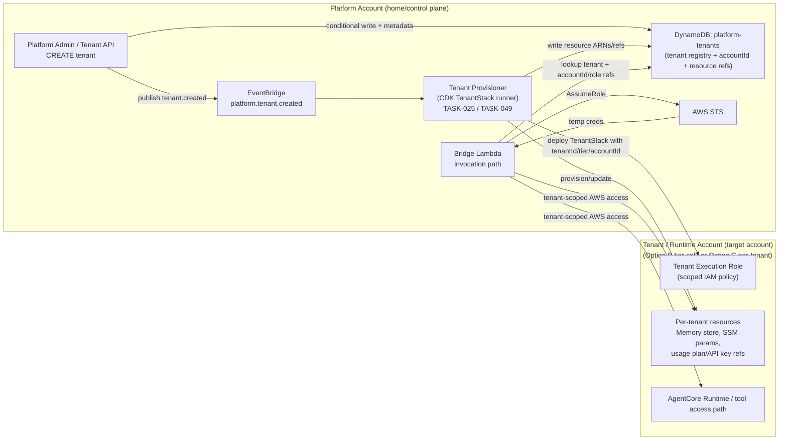

# Architecture

## System Context

The platform exposes a REST API over which B2B tenants invoke AI agents. Each tenant
is a business customer with their own isolated data, memory, and tool access. Internally,
agent developer teams push specialised agents to the platform independently of platform
infrastructure releases. Platform operators monitor, scale, and respond to incidents.

## Region Topology

```
eu-west-2 London (HOME — owns everything)
├── REST API Gateway + WAF
├── CloudFront + SPA (S3)
├── AgentCore Gateway (native)
├── AgentCore Memory (native)
├── AgentCore Identity (native)
├── All DynamoDB tables
├── All S3 buckets
├── Secrets Manager
├── SSM Parameter Store
├── EventBridge
├── SQS (async job queue)
├── Bridge Lambda
├── Authoriser Lambda
├── Tenant API Lambda
├── BFF Lambda
├── CloudWatch (aggregated)
└── KMS keys

eu-west-1 Dublin (COMPUTE — runtime only)
├── AgentCore Runtime (arm64 Firecracker microVM)
├── AgentCore Observability (traces forwarded to London)
├── AgentCore Browser
└── AgentCore Code Interpreter

eu-central-1 Frankfurt (EVALUATION — async, non-real-time)
├── AgentCore Evaluations
└── AgentCore Policy (preview — currently Bedrock Guardrails in prod)
```

All data remains in the EU. The zigzag to Dublin adds ~12ms RTT.
Failover: Dublin → Frankfurt on ServiceUnavailableException.
Failover controlled by SSM /platform/config/runtime-region with DynamoDB distributed lock.

## Request Lifecycle (Synchronous)

```
Client
  → CloudFront (CSP headers, edge caching)
  → REST API Gateway (usage plan throttle, WAF)
  → Authoriser Lambda eu-west-2
      Validates Entra JWT (JWKS cached 5min in /tmp)
      Checks roles claim for admin routes
      Returns tenant context: tenantid, appid, tier, sub
      Returns usageIdentifierKey for usage plan enforcement
  → Bridge Lambda eu-west-2
      Reads invocation_mode from DynamoDB agent registry
      Assumes tenant execution role via STS
      Reads active runtime region from SSM (cached 60s)
      Invokes AgentCore Runtime eu-west-1 via bedrock-agentcore SDK
      Writes INVOCATION record to DynamoDB on completion
  → AgentCore Runtime eu-west-1
      Firecracker microVM isolation per session
      Calls tools via AgentCore Gateway eu-west-2
      Gateway REQUEST interceptor: issues scoped act-on-behalf token
      Tool Lambda eu-west-2: executes with scoped token
      Gateway RESPONSE interceptor: filters by tier, redacts PII
  → Response stream back through bridge → API Gateway → client
```

## Invocation Modes

Three modes, declared in agent pyproject.toml [tool.agentcore.invocation_mode].
Never inferred. Bridge Lambda routes based on declared mode.

**sync** — max 15 minutes, direct response
Bridge Lambda waits for Runtime completion. Returns full response.
Use for: interactive queries, classification, tool lookups.

**streaming** — max 15 minutes, SSE chunked
Bridge Lambda relays SSE chunks as they arrive via Lambda response streaming.
SPA uses Fetch + ReadableStream (not EventSource — cannot carry Authorization header).
Use for: chat interfaces, narrated reasoning.

**async** — max 8 hours, 202 Accepted immediately
Bridge Lambda returns 202 with jobId. Agent code calls `app.add_async_task` to keep
session HealthyBusy during background work. Calls `app.complete_async_task` when done.
Client polls GET /v1/jobs/{jobId} or registers webhook.
Use for: research agents, batch processing, multi-step workflows.

## Tenant Isolation Model

Isolation enforced at four independent layers. A single-layer breach does not
compromise tenant data.

```
Layer 1: REST API authoriser — validates JWT, rejects invalid/suspended tenants
Layer 2: Bridge Lambda — assumes tenant execution role (tenant owns their data)
Layer 3: Gateway interceptors — scoped act-on-behalf token, tier-filtered tools
Layer 4: data-access-lib — TenantScopedDynamoDB raises TenantAccessViolation
         if any operation accesses outside the caller's tenant partition
```

## Data Model (DynamoDB Tables)

**platform-tenants** — tenant registry
- PK: TENANT#{tenantId}, SK: METADATA
- Attributes: tenantId, appId, displayName, tier, status, createdAt, updatedAt,
  ownerEmail, ownerTeam, memoryStoreArn, runtimeRegion, fallbackRegion,
  apiKeySecretArn, monthlyBudgetUsd, accountId
- Capacity: provisioned, auto-scaling, 5 RCU/WCU minimum

**platform-agents** — agent registry
- PK: AGENT#{agentName}, SK: VERSION#{semver}
- Attributes: agentName, version, ownerTeam, tierMinimum, layerHash,
  layerS3Key, scriptS3Key, runtimeArn, deployedAt, invocationMode,
  streamingEnabled, estimatedDurationSeconds
- Capacity: provisioned, auto-scaling

**platform-invocations** — invocation audit log
- PK: TENANT#{tenantId}, SK: INV#{timestamp}#{invocationId}
- Attributes: invocationId, tenantId, appId, agentName, agentVersion,
  sessionId, inputTokens, outputTokens, latencyMs, status, errorCode,
  runtimeRegion, invocationMode, jobId
- TTL: 90 days. Capacity: on-demand (unpredictable volume)
- Hot partition protection: SK includes random jitter suffix for high-volume tenants

**platform-jobs** — async job tracking
- PK: JOB#{jobId}, SK: METADATA
- Attributes: jobId, tenantId, agentName, status, createdAt, startedAt,
  completedAt, resultS3Key, errorMessage, webhookUrl, webhookDelivered
- TTL: 7 days. Capacity: on-demand

**platform-sessions** — active session tracking
- PK: TENANT#{tenantId}, SK: SESSION#{sessionId}
- Attributes: sessionId, runtimeSessionId, agentName, startedAt, lastActivityAt, status
- TTL: 24 hours after last activity

**platform-tools** — Gateway tool registry
- PK: TOOL#{toolName}, SK: TENANT#{tenantId} or GLOBAL
- Attributes: toolName, tierMinimum, lambdaArn, gatewayTargetId, enabled

**platform-ops-locks** — distributed operation locks
- PK: LOCK#{lockName}, SK: METADATA
- Attributes: lockId, acquiredBy, acquiredAt, ttl (5-minute auto-expire)
- Used for: region failover, account scaling transitions

## Scaling Model

Five independent scaling layers. Each layer has a monitoring threshold and a
documented response in the runbooks.

```
Layer 1 — REST API usage plans: per-tenant rate limits enforced natively by API Gateway
  basic:    10 rps, 100 burst, 1000 req/day
  standard: 50 rps, 500 burst, 10000 req/day
  premium:  500 rps, 2000 burst, unlimited

Layer 2 — Bridge Lambda: reserved concurrency 200 prod, 50 staging
  Alert at 80% utilisation. Provisioned concurrency 10 on authoriser.

Layer 3 — AgentCore Runtime: auto-scales, per-account quota applies
  Monitor: AgentCore ConcurrentSessions metric
  At 70%: RUNBOOK-002 (quota monitoring)
  At 90%: pause new basic/standard onboarding, RUNBOOK-004 (quota increase)

Layer 4 — DynamoDB: on-demand for invocations, provisioned for config tables
  Hot partition mitigation: jitter suffix on high-volume tenant invocation SKs

Layer 5 — Account topology (escalating isolation)
  Option A: single Runtime account (start here, <70% quota)
  Option B: tier-split accounts (premium separate, RUNBOOK-004 triggers)
  Option C: per-tenant accounts (enterprise/regulated, manual trigger)
```

Planned cross-account tenant provisioning and runtime access flow (Option B/C):



## Failure Modes

| ID    | Failure                        | Detection                          | Response           |
|-------|--------------------------------|------------------------------------|--------------------|
| FM-1  | Runtime region unavailable     | ServiceUnavailableException        | RUNBOOK-001        |
| FM-2  | Authoriser cold start spike    | P99 > 500ms on authoriser metric   | Provisioned concurrency |
| FM-3  | Secrets Manager throttling     | Cache in Lambda /tmp with TTL      | By design, no alert |
| FM-4  | DynamoDB hot partition         | Throttle events on invocations     | Jitter suffix on SK |
| FM-5  | Bridge Lambda timeout          | 504 to client, structured error    | 16-min Lambda timeout |
| FM-6  | Interceptor retry storm        | DLQ alarm                          | Idempotency key    |
| FM-7  | AgentCore Memory unavailable   | Degraded mode metric               | Agent runs without LTM |
| FM-8  | Usage plan quota exhausted     | 429 from API Gateway               | By design, native  |
| FM-9  | DLQ message arrival            | DLQ CloudWatch alarm               | RUNBOOK-005        |
| FM-10 | Billing Lambda failure         | DLQ alarm, eventually consistent   | RUNBOOK-006        |

## Security Model

Authentication chain:
```
Human user → MSAL.js → Entra OIDC → Bearer JWT → Authoriser Lambda validates
Machine → SigV4 → Authoriser Lambda validates
Both → tenantid, appid, tier, roles injected into request context
Admin routes → roles claim must contain Platform.Admin or Platform.Operator
```

Identity propagation:
```
Client JWT validated at authoriser (Layer 1)
Bridge Lambda assumes tenant execution role (Layer 2)
Agent invokes tool via Gateway
REQUEST interceptor issues scoped act-on-behalf token (Layer 3)
Tool Lambda receives scoped token only — never the original user JWT
```

Entra RBAC groups → JWT roles claims:
```
platform-admins     → Platform.Admin    → admin-only routes
platform-operators  → Platform.Operator → operator routes
agent-developers    → Agent.Developer   → agent push pipeline
tenant-basic        → Agent.Invoke tier:basic
tenant-standard     → Agent.Invoke tier:standard
tenant-premium      → Agent.Invoke tier:premium
```

## CDK Stack Deployment Order

1. NetworkStack    — VPC, subnets, VPC endpoints, SGs, eu-west-2
2. IdentityStack   — GitLab OIDC WIF roles, Entra JWKS layer, KMS keys
3. PlatformStack   — REST API, WAF, CloudFront, Bridge, BFF, Authoriser, Gateway
4. TenantStack     — per-tenant Memory store, execution role, usage plan key, SSM
5. ObservabilityStack — dashboards, alarms, metric streams eu-west-1→eu-west-2
6. AgentCoreStack  — Runtime config eu-west-1, cross-region resource wiring

TenantStack deploys per-tenant on EventBridge platform.tenant.created event.
It is NOT deployed by the platform pipeline — only triggered by tenant provisioning.

## Known Constraints

- AgentCore Runtime not available in eu-west-2 at GA — zigzag to eu-west-1 is structural
- AgentCore Gateway timeout: 5 minutes — unsuitable for tools requiring >5min response
- AgentCore Code Interpreter: 25 concurrent sessions per account per region
- arm64 only in Runtime — all Python deps must be cross-compiled
- Session idle timeout: 15 minutes — BFF keepalive required for long UI sessions
- REST API synchronous timeout: 15 minutes (not 29 seconds — Lambda can run to 15min)
