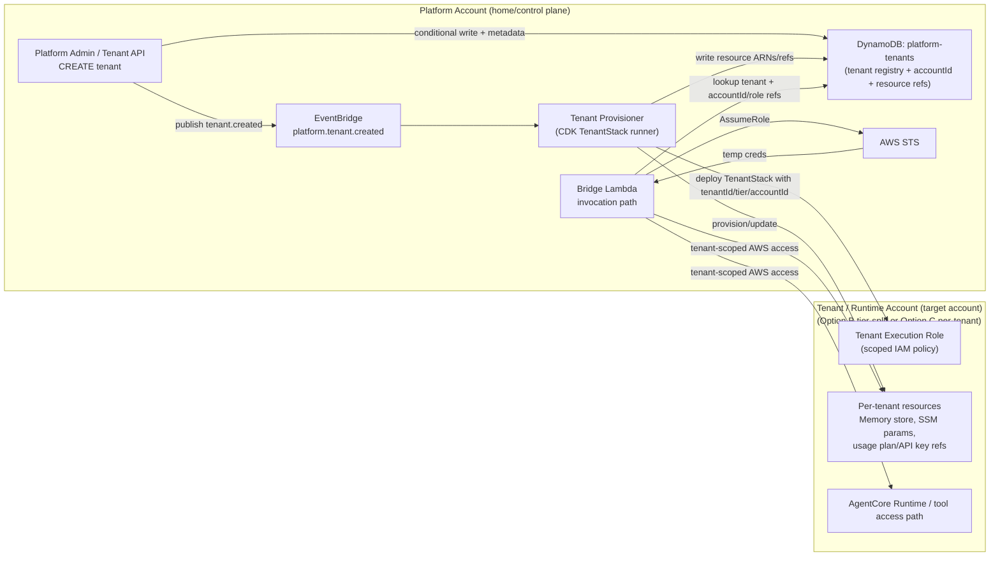

# Architecture

> See also: [Diagram Catalog](README.md#diagram-catalog) | [Threat Model](security/THREAT-MODEL.md) | [ADR Index](README.md#architecture-decision-records)

## System Context

The platform exposes a REST API over which B2B tenants invoke AI agents. Each tenant
is a business customer with their own isolated data, memory, and tool access. Internally,
agent developer teams push specialised agents to the platform independently of platform
infrastructure releases. Platform operators monitor, scale, and respond to incidents.

## Architecture Overview


**Audience-specific views:**
- [Engineer architecture](images/tf_acore_aas_architecture_engineer.drawio.png) — explicit service interactions and data flows
- [Executive architecture](images/tf_acore_aas_architecture_exec.drawio.png) — business-risk controls and compliance boundaries

## Region Topology

```
eu-west-2 London (HOME — owns everything)
├── REST API Gateway + WAF
├── CloudFront + SPA (S3, no CloudFront WebACL by explicit exception)
├── AgentCore Gateway (native)
├── AgentCore Memory (native)
├── AgentCore Identity (native)
├── All DynamoDB tables
├── All S3 buckets
├── Secrets Manager
├── SSM Parameter Store
├── AppConfig
├── EventBridge
├── SQS (webhook delivery retry queue only, not async invocation routing)
├── Bridge Lambda
├── Authoriser Lambda
├── Tenant API Lambda
├── BFF Lambda
├── CloudWatch (aggregated)
└── KMS keys

eu-west-1 Dublin (COMPUTE — current primary runtime region by platform policy)
├── AgentCore Runtime (arm64 Firecracker microVM)
├── AgentCore runtime telemetry metric stream to London
├── AgentCore Browser
└── AgentCore Code Interpreter

eu-central-1 Frankfurt (EVALUATION + failover)
├── AgentCore Evaluations
├── AgentCore Policy (Cedar) for Gateway authorization decisions
└── Runtime failover target
```

All data remains in the EU. The current approved zigzag to Dublin adds ~12ms RTT.
AWS documentation now shows AgentCore Runtime and Policy available in multiple EU
regions, including London, Dublin, and Frankfurt, but this platform continues to use
the ADR-009 London-home / Dublin-runtime topology. That deployment policy remains in
force pending an explicit architecture review and controlled migration plan.

Current runtime network posture: `AWS::BedrockAgentCore::Runtime` remains in
`NetworkMode: PUBLIC` by explicit exception, not by omission. The reason is structural:
the approved ADR-009 deployment path places Runtime in eu-west-1, while this repository
currently provisions VPC infrastructure only in eu-west-2. Moving Runtime to `VPC`
requires a dedicated eu-west-1 VPC design covering subnets, security groups, required
service endpoints, and egress policy. Until that exists and a successor ADR approves
the migration, the runtime stack records the exception in CloudFormation metadata and
tests/guard rules enforce that `PUBLIC` cannot remain an undocumented default.

Policy in AgentCore is GA and baseline Cedar enforcement is now wired into the
platform. Additional policy tuning remains an ongoing platform task.

Failover: Dublin → Frankfurt on `ServiceUnavailableException`
([RUNBOOK-001](operations/RUNBOOK-001-runtime-region-failover.md)).
Failover controlled by SSM `/platform/config/runtime-region` with DynamoDB distributed lock.

Dynamic tenant capability policy uses AppConfig in the home region. AppConfig is
reserved for rollout-sensitive capability policy only; runtime parameters remain
in SSM and tenant/resource metadata remains in DynamoDB. See
[ADR-017](decisions/ADR-017-tenant-capability-configuration-model.md).

## Request Lifecycle (Synchronous)


```
Client
  → CloudFront (CSP headers, edge caching, no CloudFront WebACL by explicit exception)
  → REST API Gateway (usage plan throttle, WAF)
  → Authoriser Lambda eu-west-2
      Validates Entra JWT (JWKS cached 5min in /tmp)
      Checks roles claim for admin routes
      Returns tenant context: tenantid, appid, tier, sub
      Returns usageIdentifierKey for usage plan enforcement
  → Bridge Lambda eu-west-2
      Reads invocation_mode from DynamoDB agent registry
      Resolves executionRoleArn from tenant metadata
        (fallback: SSM /platform/tenants/{tenantId}/execution-role-arn)
      Validates IAM role ARN/account match, then assumes tenant execution role via STS
        Role policy authorises AgentCore runtime invocation only in the approved
        runtime region set (current primary eu-west-1, failover eu-central-1)
      Reads active runtime region from SSM (cached 60s)
      Invokes AgentCore Runtime in the active runtime region (default eu-west-1)
        via bedrock-agentcore SDK
      Writes INVOCATION record to DynamoDB on completion
  → AgentCore Runtime eu-west-1
      Firecracker microVM isolation per session
      NetworkMode PUBLIC by explicit exception until runtime-region VPC exists
      Calls tools via AgentCore Gateway eu-west-2
      Gateway policy engine: Cedar evaluation (LOG_ONLY in dev/staging, ENFORCE in prod)
      Gateway REQUEST interceptor: issues scoped act-on-behalf token
      Tool Lambda eu-west-2: executes with scoped token
      Gateway RESPONSE interceptor: filters by tier, redacts PII
  → Response stream back through bridge → API Gateway → client
```

Current SPA edge exception: the public SPA distribution does not yet have its own
CloudFront-scope WebACL. That is intentional for now, not an undocumented omission.
The current approved region topology in [ADR-009](decisions/ADR-009-region-zigzag.md)
keeps the platform home region in eu-west-2, while CloudFront-scope WAF resources
require a dedicated global/us-east-1 management path. This repository does not yet
contain an approved edge-security stack for that path, so the documented posture is:
CloudFront provides TLS termination, OAC-backed S3 origin protection, and SPA security
headers, while the WAF-enforced northbound boundary starts at REST API Gateway.
Any future move to attach a CloudFront WebACL must be an explicit architecture change,
not silent drift in stack code.

## Invocation Modes

Three modes, declared in agent `pyproject.toml` under `[tool.agentcore.invocation_mode]`.
Never inferred. Bridge Lambda routes based on declared mode.
See [ADR-005](decisions/ADR-005-declared-invocation-mode.md).

| Mode | Timeout | Response | Use for |
|------|---------|----------|---------|
| **sync** | 15 min | Direct full response | Interactive queries, classification, tool lookups |
| **streaming** | 15 min | SSE chunked via Lambda response streaming | Chat interfaces, narrated reasoning |
| **async** | 8 hours | 202 Accepted + jobId; poll or webhook | Research agents, batch processing, multi-step workflows |

**Async detail:** Agent code calls `app.add_async_task` to keep session HealthyBusy during
background work, then `app.complete_async_task` when done. Client polls
`GET /v1/jobs/{jobId}` or registers a webhook. No standalone async-runner Lambda;
no SQS routing for invocation execution. See [ADR-010](decisions/ADR-010-async-agentcore-native.md).

## Interactive AG-UI Path (Proposed)

The current approved northbound invoke path remains the REST control plane:
CloudFront → REST API Gateway → Authoriser Lambda → Bridge Lambda →
AgentCore Runtime.

AgentCore AG-UI is a proposed additive path for human interactive experiences in
the SPA. It is not a replacement for the REST bridge and is not the canonical
public API for B2B tenant integrations.

Proposed AG-UI shape:

```text
SPA
  → Platform bootstrap endpoint
      Validates Entra identity and tenant context
      Confirms agent is AG-UI-capable
      Records audit/session metadata
      Returns constrained AG-UI connection details
  → Per-agent AgentCore AG-UI runtime
      SSE or WebSocket interactive session
      Human-facing real-time interaction only
```

Design constraints:
- REST remains the supported machine/API invocation path
- AG-UI is per-agent, not a shared runtime
- No Cognito is introduced; any AG-UI auth flow must remain compatible with the
  Entra-first identity model
- Platform bootstrap remains the policy and audit boundary for AG-UI sessions

See [ADR-018](decisions/ADR-018-agentcore-ag-ui-integration.md).

## Tenant Isolation Model

Isolation enforced at four independent layers. A single-layer breach does not
compromise tenant data. See [Threat Model](security/THREAT-MODEL.md) for attack surface analysis.

| Layer | Component | Enforcement |
|-------|-----------|-------------|
| 1 | REST API Authoriser | Validates JWT, rejects invalid/suspended tenants |
| 2 | Bridge Lambda | Assumes tenant-specific IAM execution role via STS |
| 3 | Gateway Interceptors | Issues scoped act-on-behalf token; tier-filtered tool access |
| 4 | data-access-lib | `TenantScopedDynamoDB` raises `TenantAccessViolation` on cross-tenant access |

See [ADR-004](decisions/ADR-004-act-on-behalf-identity.md) for the identity propagation design.

### Reserved Internal Tenant

The platform defines one reserved internal tenant identifier: `platform`.

This tenant is used only for platform-owned control-plane agents and operator-assisted
automation. It is not assignable to customer tenants and is rejected by tenant
creation flows.

The `platform` tenant is still a real tenant context for observability and audit:
- every request carries `tenantid=platform`
- every log line, metric, and trace annotation includes `tenantid=platform`
- the acting operator or service principal is recorded alongside the platform tenant
  context

The `platform` tenant is not a super-tenant. It does not receive implicit cross-tenant
data access. Any action against a customer tenant must flow through explicit
control-plane APIs or workflows that:
- validate the target tenant
- enforce platform RBAC
- emit audit events
- preserve target-tenant identity in downstream actions

See [ADR-016](decisions/ADR-016-platform-internal-tenant.md) for the reserved internal
tenant model.

## Request Lifecycle (Platform Operator / Internal Agent)

```text
Operator
  → SPA / Admin surface
  → Entra OIDC
  → REST API Gateway
  → Authoriser Lambda
      Validates Entra JWT
      Confirms platform role claims (for example Platform.Admin / Platform.Operator)
      Returns caller context with tenantid=platform for platform-agent routes
  → Platform Agent / Control-Plane Handler
      Operates within reserved tenant `platform`
      May inspect platform-owned control-plane state directly where authorised
      Must use explicit admin/control-plane APIs or workflows for target-tenant actions
      Emits audit records including:
        acting principal
        tenantid=platform
        targetTenantId (when applicable)
        operation type
        outcome
  → Response back through API Gateway → client
```

Design rule: platform agents assist and orchestrate control-plane operations; they do
not bypass the control plane.

## Configuration Ownership Model

The platform splits configuration ownership by change semantics rather than by
team preference:

| Store | Owns | Does not own |
|-------|------|--------------|
| **AppConfig** | Dynamic tenant capability policy: tier feature enablement, capability flags, kill switches, model/tool availability, rollout controls | Tenant state, resource inventory, execution-role ARNs, memory-store ARNs |
| **SSM Parameter Store** | Platform/runtime parameters: active runtime region, failover parameters, stable service endpoints, AppConfig bootstrap identifiers | Tenant feature policy, invocation state |
| **DynamoDB** | Tenant metadata and transactional state: status, budgets, execution-role ARN, memory-store ARN, audit/job/session records | Rollout-managed capability toggles |

Control-plane Lambdas cache capability policy locally and evaluate it with
deny-by-default fallback semantics: use the last known good AppConfig document
when available, otherwise fall back to an empty policy that enables nothing.
Kill switches override all rollout rules. Rollback of capability changes uses
AppConfig version history rather than ad hoc DynamoDB edits.

### Safe Defaults And Fallbacks

- **AppConfig** is fail-closed for tenant capabilities. If a fetch fails, use the
  last known good cached document; if none exists, use an empty policy that
  enables nothing. Control-plane code must not reconstruct capability policy
  from DynamoDB or SSM.
- **SSM Parameter Store** is for operational inputs only. Missing or invalid SSM
  values must never widen tenant capability access. Where a runtime-safe default
  exists in code, it must be an explicitly approved operational default inside
  the ADR-defined region policy, not an inferred tenant-policy value.
- **DynamoDB** remains authoritative for tenant metadata and transactional state.
  If required tenant or resource records are absent, handlers fail the specific
  operation rather than rebuilding tenant state from AppConfig documents or SSM
  parameters.

## Entity Lifecycle


## Data Model (DynamoDB Tables)

See [ADR-012](decisions/ADR-012-dynamodb-capacity.md) for capacity mode rationale.

**platform-tenants** — tenant registry
- PK: `TENANT#{tenantId}`, SK: `METADATA`
- Attributes: tenantId, appId, displayName, tier, status, createdAt, updatedAt,
  ownerEmail, ownerTeam, memoryStoreArn, runtimeRegion, fallbackRegion,
  apiKeySecretArn, monthlyBudgetUsd, accountId
- Excludes dynamic capability policy. Capability flags, kill switches, and
  rollout-managed model/tool availability live in AppConfig, not in this table.
- Capacity: provisioned, auto-scaling, 5 RCU/WCU minimum
- Tenant ID policy (create boundary):
  - Canonicalized to lowercase before persistence
  - Regex: `^[a-z](?:[a-z0-9-]{1,30}[a-z0-9])$` (3–32 chars)
  - No consecutive hyphens; reserved IDs rejected (`platform`, `admin`, `root`, `system`, `stub`)
  - Existing pre-policy tenant IDs remain valid; policy enforced for new creates only
  - `platform` is reserved for internal control-plane use and must never be created
    through customer or self-service flows

**platform-agents** — agent registry
- PK: `AGENT#{agentName}`, SK: `VERSION#{semver}`
- Attributes: agentName, version, ownerTeam, tierMinimum, layerHash,
  layerS3Key, scriptS3Key, runtimeArn, deployedAt, invocationMode,
  streamingEnabled, estimatedDurationSeconds, status, approvedBy,
  approvedAt, releaseNotes
- Capacity: provisioned, auto-scaling

### Agent Release State Source Of Truth

The release state of an immutable built agent version is owned by
`platform-agents.status` in DynamoDB. The canonical lifecycle is:

`built -> deployed_staging -> integration_verified -> evaluation_passed -> approved -> promoted`

Terminal branches:
- `failed` from any pre-promoted gate
- `rolled_back` from `promoted`

Only `promoted` versions are tenant-invokable. The Bridge resolves the active
version as the highest semver record for an agent where `status=promoted`.
Rollback is a forward metadata transition on the bad version; the Bridge then
falls back to the next-highest promoted version without rebuilding artifacts.

### Release Lifecycle Audit Events

Promotion and rollback are control-plane mutations owned by `tenant-api`. After
the `platform-agents` record is updated successfully, `tenant-api` emits one
EventBridge event on the platform event bus with detail type:

- `platform.agent_version.promoted`
- `platform.agent_version.rolled_back`

Event detail schema:

| Field | Meaning |
|-------|---------|
| `schemaVersion` | Payload schema version for downstream consumers |
| `operation` | `promotion` or `rollback` |
| `occurredAt` | ISO 8601 UTC timestamp for the persisted transition |
| `actorTenantId` / `actorAppId` / `actorSub` | Control-plane actor identity; platform-operated routes should carry `tenantid=platform` |
| `releaseId` | Stable immutable release identifier: `{agentName}:{version}` |
| `agentRecordPk` / `agentRecordSk` | Stable DynamoDB identifiers for the release record |
| `agentName` / `version` | Human-readable release identifiers |
| `previousStatus` / `status` | Canonical lifecycle transition |
| `approvedBy` / `approvedAt` | Approval evidence attached to the release, when present |
| `releaseNotes` | Operator-supplied promotion or rollback evidence |
| `evaluationScore` / `evaluationReportUrl` | Evaluation evidence recorded on promotion, when supplied |
| `rolledBackBy` / `rolledBackAt` | Rollback actor and timestamp, when the transition is `rolled_back` |

Semantics:
- emitted only for the auditable terminal control-plane transitions covered by ADR-015: `approved -> promoted` and `promoted -> rolled_back`
- emitted after the DynamoDB update succeeds, so consumers never observe a promotion or rollback that failed persistence
- one event per successful transition; consumers should treat `releaseId` plus `status` as the stable release transition identity and may also use the EventBridge envelope `id` for delivery-level deduplication

Operational consumers:
- operator-facing release dashboards and timelines
- compliance/audit export pipelines that need immutable release history
- downstream release automation that reacts to confirmed promotion or rollback state changes

**platform-invocations** — invocation audit log
- PK: `TENANT#{tenantId}`, SK: `INV#{timestamp}#{invocationId}`
- Attributes: invocationId, tenantId, appId, agentName, agentVersion,
  sessionId, inputTokens, outputTokens, latencyMs, status, errorCode,
  runtimeRegion, invocationMode, jobId
- TTL: 90 days. Capacity: on-demand (unpredictable volume)
- Hot partition protection: SK includes random jitter suffix for high-volume tenants

**platform-jobs** — async job tracking
- PK: `TENANT#{tenantId}`, SK: `JOB#{jobId}`
- Attributes: jobId, tenantId, agentName, status, createdAt, startedAt,
  completedAt, resultS3Key, errorMessage, webhookUrl, webhookDelivered
- TTL: 7 days. Capacity: on-demand

**platform-sessions** — active session tracking
- PK: `TENANT#{tenantId}`, SK: `SESSION#{sessionId}`
- Attributes: sessionId, runtimeSessionId, agentName, startedAt, lastActivityAt, status
- TTL: 24 hours after last activity

**platform-tools** — Gateway tool registry
- PK: `TOOL#{toolName}`, SK: `TENANT#{tenantId}` or `GLOBAL`
- Attributes: toolName, tierMinimum, lambdaArn, gatewayTargetId, enabled

**platform-ops-locks** — distributed operation locks
- PK: `LOCK#{lockName}`, SK: `METADATA`
- Attributes: lockId, acquiredBy, acquiredAt, ttl (5-minute auto-expire)
- Used for: region failover, account scaling transitions

## Scaling Model

Five independent scaling layers. Each layer has a monitoring threshold and a
documented response in the [operator runbooks](README.md#operator-runbooks).

| Layer | Mechanism | Limits | Monitoring / Response |
|-------|-----------|--------|----------------------|
| 1 | REST API usage plans | basic: 10 rps / 1K/day, standard: 50 rps / 10K/day, premium: 500 rps / unlimited | Native API Gateway 429 |
| 2 | Bridge Lambda concurrency | 200 prod, 50 staging | Alert at 80%; provisioned concurrency 10 on authoriser |
| 3 | AgentCore Runtime | Auto-scales, per-account quota | 70%: [RUNBOOK-002](operations/RUNBOOK-002-quota-monitoring.md); 90%: [RUNBOOK-004](operations/RUNBOOK-004-quota-increase.md) |
| 4 | DynamoDB | On-demand for invocations, provisioned for config | Jitter suffix on high-volume tenant SKs |
| 5 | Account topology | Option A (single) → B (tier-split) → C (per-tenant) | Escalate when quota thresholds require |

## Platform-Controlled Cross-Tenant Actions

Cross-tenant actions are permitted only through explicit control-plane paths. The
reserved `platform` tenant does not authorize broad direct access to customer data.

Approved cross-tenant actions must:
- originate from a caller with platform RBAC
- record both acting tenant (`platform`) and target tenant
- execute through documented admin APIs, workflows, or orchestrations
- preserve tenant isolation for all direct data-plane access

This preserves the rule that normal tenant data access remains structurally
tenant-scoped even when initiated by platform-owned automation.

### Cross-Account Tenant Provisioning (Option B/C)


```mermaid
flowchart LR
  subgraph P["Platform Account (home/control plane)"]
    Admin["Platform Admin / Tenant API\nCREATE tenant"]
    Tenants["DynamoDB: platform-tenants\n(tenant registry + accountId + resource refs)"]
    EB["EventBridge\nplatform.tenant.created"]
    Prov["Tenant Provisioner\n(CDK TenantStack runner)"]
    Bridge["Bridge Lambda\ninvocation path"]
    STS["AWS STS"]
  end

  subgraph T["Tenant / Runtime Account (target account)\n(Option B tier-split or Option C per-tenant)"]
    Role["Tenant Execution Role\n(scoped IAM policy)"]
    TenantRes["Per-tenant resources\nMemory store, SSM params,\nusage plan/API key refs"]
    Runtime["AgentCore Runtime / tool access path"]
  end

  Admin -->|conditional write + metadata| Tenants
  Admin -->|publish tenant.created| EB
  EB --> Prov
  Prov -->|deploy TenantStack with tenantId/tier/accountId| Role
  Prov -->|provision/update| TenantRes
  Prov -->|write resource ARNs/refs| Tenants

  Bridge -->|lookup tenant + accountId/role refs| Tenants
  Bridge -->|AssumeRole| STS
  STS -->|temp creds| Bridge
  Bridge -->|tenant-scoped AWS access| Runtime
  Bridge -->|tenant-scoped AWS access| TenantRes
```

## CDK Stack Dependencies


**Audience-specific views:**
- [Engineer CDK dependencies](images/tf_acore_aas_cdk_dependencies_engineer.drawio.png) — code-level dependency relationships
- [Executive CDK dependencies](images/tf_acore_aas_cdk_dependencies_exec.drawio.png) — planning and governance view

See [ADR-007](decisions/ADR-007-cdk-terraform.md) for the CDK vs Terraform split rationale.

### Deployment Order

| Order | Stack | Region | Resources |
|-------|-------|--------|-----------|
| 1 | NetworkStack | eu-west-2 | VPC, subnets, VPC endpoints, security groups |
| 2 | IdentityStack | eu-west-2 | GitLab OIDC WIF roles, Entra JWKS layer, KMS keys |
| 3 | PlatformStack | eu-west-2 | REST API, WAF, CloudFront, Bridge, BFF, Authoriser, Gateway |
| 4 | TenantStack | eu-west-2 | Per-tenant Memory store, execution role, usage plan key, SSM |
| 5 | ObservabilityStack | eu-west-2 | Dashboards, alarms, monitoring-account OAM sink only |
| 6 | AgentCoreStack | eu-west-1 | Runtime config, metric stream to eu-west-2 observability |

TenantStack deploys per-tenant on EventBridge `platform.tenant.created` event.
It is **not** deployed by the platform pipeline — only triggered by tenant provisioning.
Existing tenants are migrated/verified with `make ops-backfill-tenant-role-arn [APPLY=1]`.

ObservabilityStack currently provisions the eu-west-2 monitoring-account OAM sink only.
No regional OAM member links are deployed yet, so the cross-region observability path
is represented today by the AgentCoreStack metric stream into eu-west-2 dashboards.

## Failure Modes

| ID | Failure | Detection | Alarm | Response |
|----|---------|-----------|-------|----------|
| FM-1 | Runtime region unavailable | `ServiceUnavailableException` | `FM-1-RuntimeRegionUnavailable` | [RUNBOOK-001](operations/RUNBOOK-001-runtime-region-failover.md) |
| FM-2 | Authoriser cold start spike | P99 > 500ms | `FM-2-AuthoriserColdStartSpike` | Provisioned concurrency |
| FM-3 | Secrets Manager throttling | Cache miss rate | `FM-3-SecretsManagerThrottling` | By design (Lambda /tmp cache with TTL) |
| FM-4 | DynamoDB hot partition | Throttle events on invocations table | `FM-4-DynamoDbHotPartition` | Jitter suffix on SK |
| FM-5 | Bridge Lambda timeout | 504 to client | `FM-5-BridgeTimeout` | 16-min Lambda timeout |
| FM-6 | Interceptor retry storm | Interceptor error rate | `FM-6-InterceptorRetryStorm` | Idempotency key |
| FM-7 | AgentCore Memory unavailable | Degraded mode metric | `FM-7-AgentCoreMemoryDegraded` | Agent runs without long-term memory |
| FM-8 | Usage plan quota exhausted | 429 from API Gateway | `FM-8-UsagePlanQuotaExhausted` | By design (native enforcement) |
| FM-9 | DLQ message arrival | DLQ CloudWatch alarm | `FM-9-DLQ-Arrival-{name}` | [RUNBOOK-005](operations/RUNBOOK-005-dlq-management.md) |
| FM-10 | Billing Lambda failure | Billing Lambda errors | `FM-10-BillingLambdaFailure` | [RUNBOOK-006](operations/RUNBOOK-006-budget-and-suspension.md) |

## Security Model

> Full analysis: [Threat Model](security/THREAT-MODEL.md) | [Compliance Checklist](security/COMPLIANCE-CHECKLIST.md)

### Authentication

```
Human user → MSAL.js → Entra OIDC → Bearer JWT → Authoriser Lambda validates
Machine    → SigV4   → Authoriser Lambda validates
Both       → tenantid, appid, tier, roles injected into request context
Admin routes → roles claim must contain Platform.Admin or Platform.Operator
```

### Identity Propagation (Act-on-Behalf)

```
Client JWT validated at authoriser (Layer 1)
Bridge Lambda assumes tenant execution role (Layer 2)
Agent invokes tool via Gateway
REQUEST interceptor issues scoped act-on-behalf token (Layer 3)
Tool Lambda receives scoped token only — never the original user JWT
```

See [ADR-004](decisions/ADR-004-act-on-behalf-identity.md).

### Entra RBAC Mapping

| Entra Group | JWT Claim | Access |
|-------------|-----------|--------|
| platform-admins | `Platform.Admin` | Admin-only routes |
| platform-operators | `Platform.Operator` | Operator routes |
| agent-developers | `Agent.Developer` | Agent push pipeline |
| tenant-basic | `Agent.Invoke` | tier:basic |
| tenant-standard | `Agent.Invoke` | tier:standard |
| tenant-premium | `Agent.Invoke` | tier:premium |

See [ADR-013](decisions/ADR-013-entra-rbac-roles-claim.md).

## Known Constraints

| Constraint | Impact | Mitigation |
|-----------|--------|------------|
| Current platform policy keeps Runtime in eu-west-1 | ~12ms RTT zigzag to Dublin even though Runtime is now available in eu-west-2 | [ADR-009](decisions/ADR-009-region-zigzag.md); topology stays in place pending explicit review and migration |
| AgentCore Gateway timeout: 5 min | Tools cannot exceed 5 min response | Design tools for fast response; long work uses async mode |
| Code Interpreter: 25 concurrent sessions | Per-account per-region limit | Monitor via [RUNBOOK-002](operations/RUNBOOK-002-quota-monitoring.md) |
| arm64 only in Runtime | All Python deps must be cross-compiled aarch64-manylinux2014 | See [ADR-001](decisions/ADR-001-agentcore-runtime.md) |
| Session idle timeout: 15 min | Long UI sessions require keepalive | BFF keepalive endpoint; see [ADR-011](decisions/ADR-011-thin-bff.md) |
| REST API sync timeout: 15 min | Not the standard 29s Lambda limit | Lambda configured for 15 min; API Gateway integration timeout matched |
