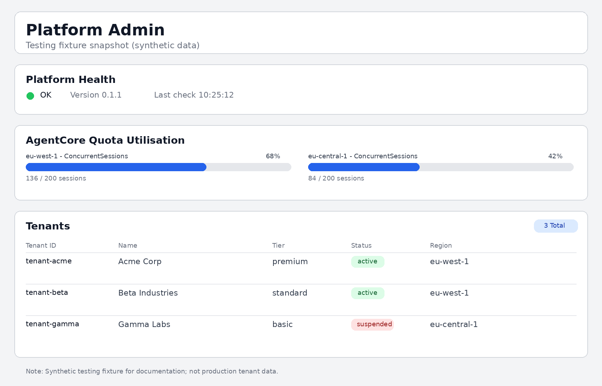

# Documentation Suite

Canonical documentation for the **tf-acore-aas** platform.
Start here, then follow the links for your role.

> Back to [project README](../README.md)

## Reading Guide (by Role)

| I am a... | Read in this order |
|-----------|-------------------|
| **New platform engineer** | [Local Setup](development/LOCAL-SETUP.md) → [Architecture](ARCHITECTURE.md) → [ADR index](#architecture-decision-records) |
| **Agent developer** | [Agent Developer Guide](development/AGENT-DEVELOPER-GUIDE.md) → [Architecture](ARCHITECTURE.md) |
| **Operator** | [Operator Onboarding](operations/RUNBOOK-009-operator-onboarding.md) → [Runbook index](#operator-runbooks) → [Bootstrap Guide](bootstrap-guide.md) |
| **Security reviewer** | [Threat Model](security/THREAT-MODEL.md) → [Compliance Checklist](security/COMPLIANCE-CHECKLIST.md) → [Architecture](ARCHITECTURE.md) |
| **Leadership** | [Roadmap](ROADMAP.md) → [Delivery Plan](PLAN.md) → [Executive Architecture](#platform-architecture) |

## Core Documents

| Document | Purpose |
|----------|---------|
| [ARCHITECTURE.md](ARCHITECTURE.md) | System topology, request lifecycle, tenant isolation, data model, scaling, failure modes |
| [PLAN.md](PLAN.md) | Phased delivery plan with gates and success criteria (Phase 0–8) |
| [ROADMAP.md](ROADMAP.md) | North-star vision, milestones M1–M7, V1.x backlog, deliberate exclusions |
| [bootstrap-guide.md](bootstrap-guide.md) | Day-zero platform deployment to a fresh AWS account |
| [entra-setup.md](entra-setup.md) | Microsoft Entra app registration and RBAC group setup |

## Architecture Decision Records

Every significant design choice is documented with context, decision, and rejected alternatives.

| ADR | Decision |
|-----|----------|
| [ADR-001](decisions/ADR-001-agentcore-runtime.md) | AgentCore Runtime over custom orchestration |
| [ADR-002](decisions/ADR-002-entra-not-cognito.md) | Microsoft Entra ID over Amazon Cognito |
| [ADR-003](decisions/ADR-003-rest-api-not-http-api.md) | REST API Gateway over HTTP API |
| [ADR-004](decisions/ADR-004-act-on-behalf-identity.md) | Act-on-behalf identity propagation, not impersonation |
| [ADR-005](decisions/ADR-005-declared-invocation-mode.md) | Declared invocation mode over runtime detection |
| [ADR-006](decisions/ADR-006-uv-pyproject.md) | uv + pyproject.toml for Python dependency management |
| [ADR-007](decisions/ADR-007-cdk-terraform.md) | CDK TypeScript for platform IaC; Terraform for account vending |
| [ADR-008](decisions/ADR-008-zip-deployment-default.md) | ZIP deployment as default; container as opt-in |
| [ADR-009](decisions/ADR-009-region-zigzag.md) | eu-west-2 London home; eu-west-1 Dublin runtime |
| [ADR-010](decisions/ADR-010-async-agentcore-native.md) | AgentCore native async over SQS routing |
| [ADR-011](decisions/ADR-011-thin-bff.md) | Thin BFF for token refresh and session keepalive only |
| [ADR-012](decisions/ADR-012-dynamodb-capacity.md) | On-demand for invocations; provisioned for config tables |
| [ADR-013](decisions/ADR-013-entra-rbac-roles-claim.md) | Entra group membership as JWT roles claim for RBAC |

## Operator Runbooks

All runbooks are executable via `make` targets — no AWS console access required.

| Runbook | Procedure | Trigger |
|---------|-----------|---------|
| [RUNBOOK-000](operations/RUNBOOK-000-bootstrap.md) | Platform bootstrap (day zero) | New environment |
| [RUNBOOK-001](operations/RUNBOOK-001-runtime-region-failover.md) | Runtime region failover | `ServiceUnavailableException` from eu-west-1 |
| [RUNBOOK-002](operations/RUNBOOK-002-quota-monitoring.md) | AgentCore quota monitoring | ConcurrentSessions > 70% |
| [RUNBOOK-003](operations/RUNBOOK-003-tenant-access-violation.md) | Tenant access violation response | `TenantAccessViolation` alarm |
| [RUNBOOK-004](operations/RUNBOOK-004-quota-increase.md) | AgentCore quota increase request | ConcurrentSessions > 90% |
| [RUNBOOK-005](operations/RUNBOOK-005-dlq-management.md) | DLQ management | DLQ CloudWatch alarm |
| [RUNBOOK-006](operations/RUNBOOK-006-budget-and-suspension.md) | Tenant budget alert and suspension | Budget threshold breach |
| [RUNBOOK-007](operations/RUNBOOK-007-deployment-rollback.md) | Deployment rollback | Failed deployment / regression |
| [RUNBOOK-008](operations/RUNBOOK-008-developer-onboarding.md) | Developer onboarding | New team member |
| [RUNBOOK-009](operations/RUNBOOK-009-operator-onboarding.md) | Operator onboarding | New ops team member |

## Security and Compliance

| Document | Purpose |
|----------|---------|
| [Threat Model](security/THREAT-MODEL.md) | Attack surfaces, threat actors, mitigations, residual risk |
| [Compliance Checklist](security/COMPLIANCE-CHECKLIST.md) | Control mapping and evidence tracking |

## Development Guides

| Document | Audience | Purpose |
|----------|----------|---------|
| [Local Setup](development/LOCAL-SETUP.md) | Platform engineers | Full local dev environment (uv, Docker, LocalStack) |
| [Agent Developer Guide](development/AGENT-DEVELOPER-GUIDE.md) | Agent developers | Build, test, package, and push agents to the platform |

## Diagram Catalog

All diagrams live in [`images/`](images/) with `.drawio` as source-of-truth and matching `.drawio.svg` + `.drawio.png` exports.
See [Diagram Semantics](#diagram-semantics) for colour conventions.

### Platform Architecture

Canonical view of the platform across three EU regions: control plane, compute, and evaluation.


| Variant | Audience | File |
|---------|----------|------|
| Standard | All | [tf_acore_aas_architecture.drawio.png](images/tf_acore_aas_architecture.drawio.png) |
| Engineer | Engineers | [tf_acore_aas_architecture_engineer.drawio.png](images/tf_acore_aas_architecture_engineer.drawio.png) |
| Executive | Leadership | [tf_acore_aas_architecture_exec.drawio.png](images/tf_acore_aas_architecture_exec.drawio.png) |

### Request Lifecycle

End-to-end request flow: authentication, authorisation, runtime execution, tool invocation via gateway interceptors, async webhook delivery, and region failover path.


| Variant | Audience | File |
|---------|----------|------|
| Engineer | Engineers | [tf_acore_aas_request_lifecycle_engineer.drawio.png](images/tf_acore_aas_request_lifecycle_engineer.drawio.png) |

### CDK Stack Dependencies

Deployment order, cross-stack resource wiring, and environment boundaries.


| Variant | Audience | File |
|---------|----------|------|
| Standard | All | [tf_acore_aas_cdk_stack_dependencies.drawio.png](images/tf_acore_aas_cdk_stack_dependencies.drawio.png) |
| Engineer | Engineers | [tf_acore_aas_cdk_dependencies_engineer.drawio.png](images/tf_acore_aas_cdk_dependencies_engineer.drawio.png) |
| Executive | Leadership | [tf_acore_aas_cdk_dependencies_exec.drawio.png](images/tf_acore_aas_cdk_dependencies_exec.drawio.png) |

### Entity State Diagram

Core platform entities — tenants, agents, invocations, jobs, sessions — and their lifecycle state transitions.


| Variant | Audience | File |
|---------|----------|------|
| Standard | All | [tf_acore_aas_entities_state_diagram.drawio.png](images/tf_acore_aas_entities_state_diagram.drawio.png) |

### Portal / Admin Console (Testing)

Admin console snapshot for testing documentation and demos.



| View | Audience | File | Notes |
|------|----------|------|-------|
| Admin console | Engineers / QA | [tf_acore_aas_admin_console_testing.png](images/tf_acore_aas_admin_console_testing.png) | Synthetic test fixture data (not production tenant data). |

## Diagram Semantics

Consistent colour semantics across all architecture diagrams:

| Colour | Meaning |
|--------|---------|
| **Blue** edges | Request / control-plane flow |
| **Green** edges | Runtime execution flow |
| **Purple** edges | Async / event flow |
| **Amber dashed** edges | Operational / failover / inferred relationship |

## Updating Diagrams

Edit `.drawio` source files in [`images/`](images/), then re-export all formats:

```bash
# Export to SVG and PNG
for f in docs/images/*.drawio; do
  drawio -x -f svg -e -o "${f}.svg" "$f"
  drawio -x -f png -e -b 10 -o "${f}.png" "$f"
done

# Verify AWS icon count per diagram
for f in docs/images/*.drawio; do
  c=$(rg -o "resIcon=mxgraph.aws4" "$f" | wc -l)
  echo "$(basename "$f") $c"
done

# Verify all exports exist (counts should match)
echo "drawio: $(ls docs/images/*.drawio | wc -l)"
echo "svg:    $(ls docs/images/*.drawio.svg | wc -l)"
echo "png:    $(ls docs/images/*.drawio.png | wc -l)"
```
