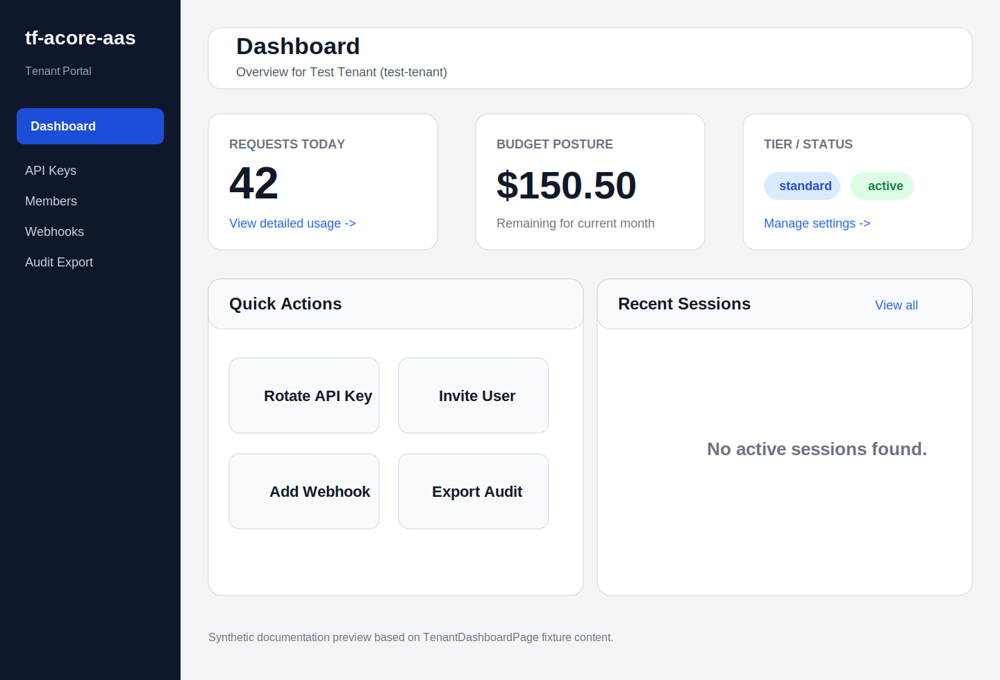
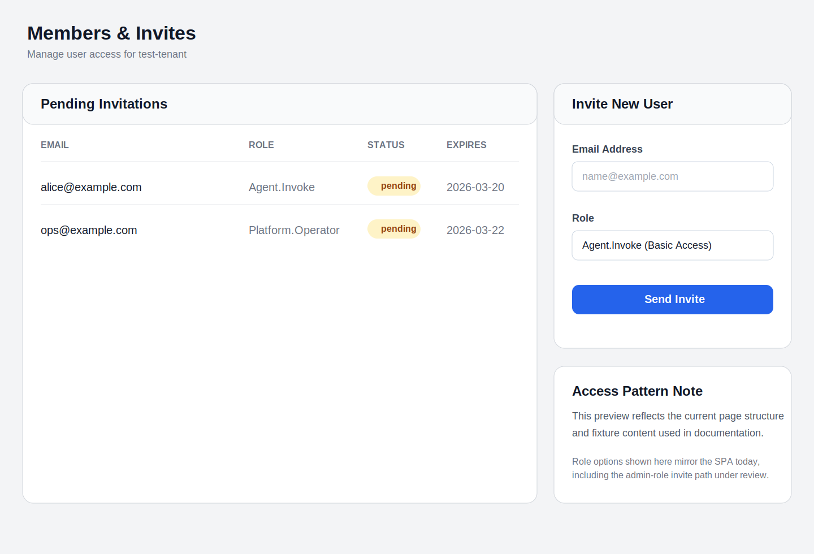
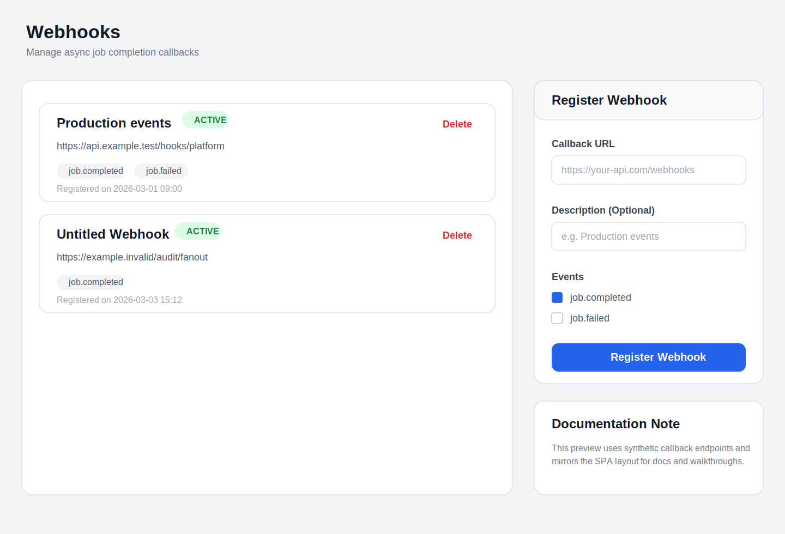
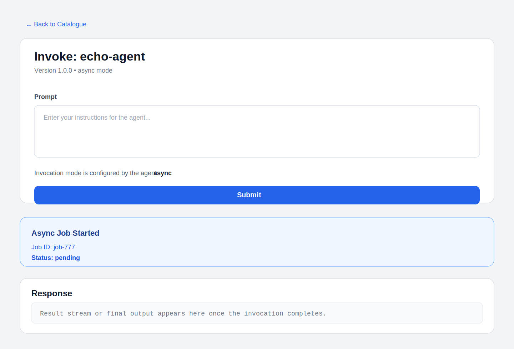

# Local Development Setup

## Prerequisites

| Tool         | Version    | Install                                          |
|--------------|------------|--------------------------------------------------|
| uv           | latest     | curl -Ls https://astral.sh/uv/install.sh | sh    |
| Docker       | 24+        | https://docs.docker.com/get-docker/              |
| AWS CLI      | v2         | https://docs.aws.amazon.com/cli/latest/userguide |
| Node         | 20 LTS     | https://nodejs.org/ or nvm                       |
| Git          | 2.30+      | system package manager                           |

## .env.local Values

Copy `.env.example` to `.env.local` and fill in these values:

| Variable              | Where to Find It                                        |
|-----------------------|----------------------------------------------------------|
| VITE_ENTRA_CLIENT_ID  | Entra portal → App Registrations → platform-{env}       |
| VITE_ENTRA_TENANT_ID  | Entra portal → Overview → Directory (tenant) ID         |
| VITE_ENTRA_SCOPES     | Entra app expose-an-API scopes (space/comma separated)  |
| VITE_API_BASE_URL     | CDK outputs after infra-deploy, or team-platform Slack   |
| GITLAB_PROJECT_ID     | GitLab project settings → General → Project ID           |

For local development only (no real AWS needed):
```bash
VITE_API_BASE_URL=http://localhost:8080
MOCK_RUNTIME=true
```

## Starting the Local Environment

```bash
make dev
```

This starts:
- **LocalStack** on :4566 — mocks S3, DynamoDB, SSM, Secrets Manager, SQS
- **Mock AgentCore Runtime** on :8765 — returns canned streaming responses
- **Mock JWKS endpoint** on :8766 — issues test JWTs

Then seeds LocalStack with two test tenants and all SSM parameters.

## Verifying the Setup

```bash
make dev-invoke
```

If this exits cleanly, the local invocation path is wired. Use `make test-int`
for a stronger end-to-end check once the local stack is running.

**Note**: The **Mock AgentCore Runtime** returns canned responses (defined in `tests/mocks/mock_runtime/main.py`). It does **not** execute your actual agent code. To test your agent's logic locally, use `make agent-test`.

## Test Tenants (seeded by dev-bootstrap.py)

After `make dev`, two test tenants are available. Their tenant IDs and JWTs are in `.env.test`:

| Variable              | Value      | Purpose  |
|-----------------------|------------|----------|
| BASIC_TENANT_ID       | t-test-001 | Local basic tenant ID |
| BASIC_TENANT_JWT      | JWT        | Basic tenant bearer token |
| PREMIUM_TENANT_ID     | t-test-002 | Local premium tenant ID |
| PREMIUM_TENANT_JWT    | JWT        | Premium tenant bearer token |
| ADMIN_TENANT_ID       | admin-001  | Platform admin tenant ID |
| ADMIN_JWT             | JWT        | Platform.Admin bearer token |

To refresh the local JWT fixtures without rerunning bootstrap, keep the dev services up and run:

```bash
uv run python scripts/dev-bootstrap.py
```

Use these with `make agent-invoke AGENT=echo-agent TENANT=t-test-001` or in your tests via `conftest.py`.

## Running Tests

```bash
make test-unit      # All Lambda unit tests against LocalStack
make test-int       # Integration tests (requires make dev running)
make agent-test AGENT=echo-agent    # Tests for a specific agent
```

## UI Testing Snapshot

Testing fixture screenshot for the Admin console:


The screenshot uses synthetic test data for documentation and QA walkthroughs.

Additional SPA previews for docs and onboarding:

- 
- 
- 
- 
- 

These are stable fixture-based renders derived from the current SPA page structure, not browser screenshots from a live environment.

## Common Issues

**LocalStack not starting**: ensure Docker is running (`docker ps` should work).

**make dev-invoke fails with 401**: LocalStack may not have finished seeding.
Wait 10 seconds and retry, or check `docker compose logs localstack`.

**uv: command not found**: run `source ~/.bashrc` or open a new terminal after install.

**CDK synth fails**: run `cd infra/cdk && npm install` first.
